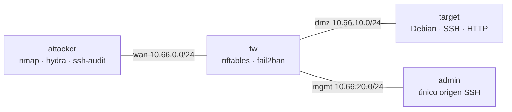

# Hardening Linux & Auditoría de Redes

[](https://github.com/micaelaalvaradomendez/hardening-network-security/actions/workflows/ci.yml)


Laboratorio reproducible de bastionado de servidores Linux y seguridad de redes: scripts Bash idempotentes con controles alineados a **CIS Debian Linux Benchmark**, filtrado stateful con **nftables**, trazabilidad con **auditd**, protección contra fuerza bruta con **fail2ban** y un **informe de pentesting ético** que mide la reducción de la superficie de ataque antes y después de la remediación.

Surge del *Diplomado Universitario en Administración de Redes Linux con Orientación en Ciberseguridad y Ethical Hacking* (UTN-FRD).

> **Estado:** en desarrollo. Ver [hoja de ruta](#hoja-de-ruta).

---

## Topología



- **Red y pentesting** → Docker Compose (`lab/compose/`).
- **Hardening de sistema operativo** (auditd, módulos de kernel, sysctl, AppArmor) → VM Vagrant (`lab/vm/`), porque un contenedor comparte el kernel del host. Dentro de un contenedor, esos controles se informan como `SKIP` en lugar de fallar.

## Uso rápido

```bash
make help       # lista de targets
make lab-up     # genera claves y levanta el laboratorio
make baseline   # auditoría previa -> evidencias/antes/
make harden     # aplica el bastionado
make audit      # auditoría posterior -> evidencias/despues/
make report     # comparativa antes/después
make lint test  # shellcheck + bats (corren en contenedores)
```

Todos los scripts de `scripts/` aceptan `--check` (default, no modifica nada) y `--apply` (aplica con backup previo). Son idempotentes.

## Estructura

| Carpeta | Contenido |
|---|---|
| `scripts/` | Bastionado: sistema, SSH, firewall, auditd, aislamiento de servicios. `lib/common.sh` define el contrato común. |
| `firewall/` | `nftables.conf` y `fail2ban/jail.local`. |
| `lab/` | Entorno reproducible: Compose (red) y Vagrant (SO). |
| `docs/` | Arquitectura de red, matriz de controles e informe de pentesting. |
| `evidencias/` | Salidas de Nmap, Lynis y ssh-audit antes y después. |
| `tests/` | Batería de verificación con bats-core. |

## Hoja de ruta

- [x] Fase 0 — Esqueleto, contrato de scripts, CI
- [ ] Fase A — Topología del laboratorio
- [ ] Fase B — Target vulnerable y auditoría baseline
- [ ] Fase C — Hardening de sistema operativo (VM)
- [ ] Fase D — Filtrado de red y fail2ban
- [ ] Fase E — Verificación y comparativa
- [ ] Fase F — Informe de pentesting

## Aviso de uso ético

Este repositorio es material educativo. Las técnicas de reconocimiento y explotación se ejecutan **exclusivamente contra los nodos del laboratorio** definidos acá. Usarlas contra sistemas sin autorización expresa y por escrito es ilegal. Todas las direcciones IP son de laboratorio.

## Licencia

[MIT](LICENSE) · Las referencias a CIS Benchmarks citan solo identificadores de control; el texto de los benchmarks pertenece al Center for Internet Security.
