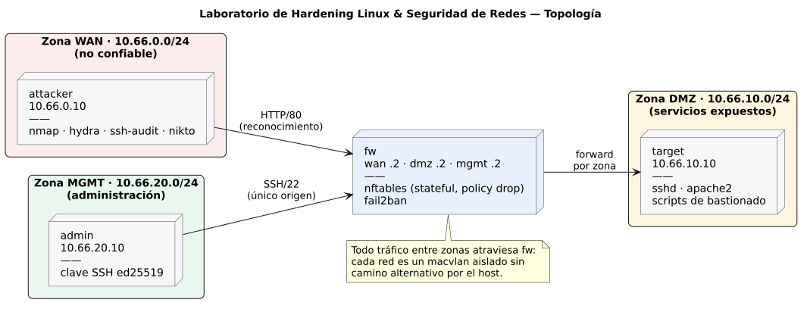

# Arquitectura de red del laboratorio



## Zonas y nodos

| Zona | Subred | Confianza | Nodo | IP | Rol |
|---|---|---|---|---|---|
| WAN | `10.66.0.0/24` | Nula | `attacker` | `10.66.0.10` | Auditor externo: reconocimiento, enumeración y explotación controlada. |
| DMZ | `10.66.10.0/24` | Baja | `target` | `10.66.10.10` | Servidor de servicios expuestos (SSH, HTTP). Objeto del bastionado. |
| MGMT | `10.66.20.0/24` | Alta | `admin` | `10.66.20.10` | Estación de administración: único origen autorizado para SSH. |
| — | las tres | — | `fw` | `.2` en cada zona | Firewall perimetral y router entre zonas. |

Convención: `.1` reservada por Docker (sin uso), `.2` firewall, `.10` nodo de la zona. Todas las direcciones son de laboratorio.

## Flujos previstos

| Origen → Destino | Servicio | Fase A (sin filtrado) | Objetivo tras Fase D |
|---|---|---|---|
| WAN → DMZ | HTTP/80 | Permitido | Permitido |
| WAN → DMZ | SSH/22 y resto | Permitido | **Bloqueado** |
| MGMT → DMZ | SSH/22 | Permitido | Permitido (rate-limit + fail2ban) |
| DMZ → MGMT | cualquiera | Permitido | **Bloqueado** (una DMZ comprometida no alcanza administración) |
| WAN → MGMT | cualquiera | Permitido | **Bloqueado** |
| Cualquiera → `fw` | cualquiera | Permitido | Solo ICMP esencial |

La Fase A deja el forwarding abierto a propósito: es el estado "antes" sobre el que se mide la reducción de superficie de ataque.

## Decisiones de diseño

### Redes macvlan `internal` en lugar de bridges

La primera versión usaba redes bridge de Docker (`internal: true` para DMZ y MGMT). El tráfico ruteado por `fw` llegaba a la interfaz `dmz` (verificado con `tcpdump`), pero nunca al `target`: **el host lo descartaba**.

Causa: con `br_netfilter` cargado y `net.bridge.bridge-nf-call-iptables = 1`, los frames que cruzan un bridge de Linux atraviesan la cadena `FORWARD` del host. Ahí un paquete con IP origen de otra subred (por ejemplo, `10.66.0.10` saliendo por el bridge de la DMZ) queda sujeto a las reglas de aislamiento de Docker y a cualquier otro componente que gestione el firewall del host (en el equipo de desarrollo, un clúster k3s con kube-router que además había eliminado las cadenas de Docker).

Solución: las tres zonas son redes **macvlan internas**. Cada una cuelga de su propia interfaz dummy, sin bridge ni reglas en el host, por lo que:

- el laboratorio no depende del estado del firewall del host (es portable a CI y a otras máquinas);
- no existe camino L2/L3 entre zonas que no pase por `fw` (verificado en `tests/test-topology.sh` bajando la pata DMZ de `fw`);
- el host no alcanza a los nodos (se opera con `docker compose exec`).

Contrapartida: los nodos no tienen salida a Internet en runtime. Todas las herramientas se instalan en el build de cada imagen.

### Nombres de interfaz por zona

`fw` usa `interface_name` de Compose: sus interfaces se llaman `wan`, `dmz` y `mgmt` en lugar de `eth0..2` (cuyo orden no está garantizado). Las reglas nftables de la Fase D se escriben con `iifname "wan"`, legibles y estables.

### Ruteo sin NAT

Los nodos de DMZ y MGMT tienen ruta por defecto vía `fw`, y `attacker` rutas explícitas a DMZ y MGMT vía `fw`. No hay NAT: el `target` ve la IP real del atacante, que es lo que necesitan los logs, auditd y fail2ban.

### Claves SSH efímeras

`make keys` genera un par ed25519 en `lab/.secrets/` (excluido de git). La pública se instala en `operador@target`; la privada, en `admin`. Las claves de host del `target` cambian con cada rebuild, por eso `admin` no persiste `known_hosts`.

## Verificación

```bash
make lab-up
make test-lab
```

| Verificación | Qué demuestra |
|---|---|
| `attacker -> target` y primer salto = `10.66.0.2` | El tráfico WAN → DMZ se rutea por `fw`. |
| `admin -> target`, `target -> admin` | Ruteo MGMT ↔ DMZ. |
| HTTP desde WAN, SSH con clave desde MGMT | Servicios del `target` operativos. |
| Cada nodo tiene una sola interfaz | Ningún nodo está "dual-homed" salvo `fw`. |
| Con `dmz` de `fw` caída, WAN no alcanza DMZ | No hay camino alternativo por el host. |
